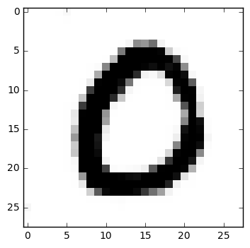
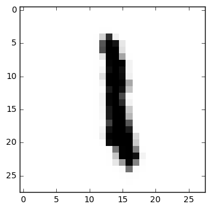
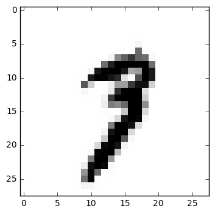
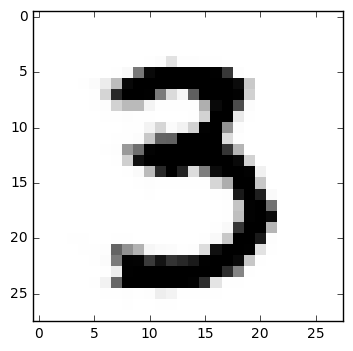
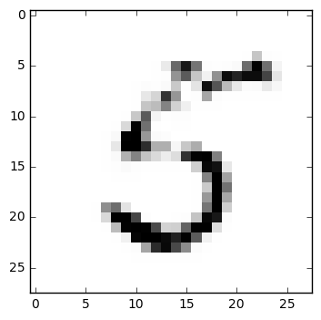

# ezgan
An extremely simple generative adversarial network, built with TensorFlow. I've written it as a personal exercise to help myself grasp the basics of GANs, and hope that it might be a useful illustration.

In order to stabilize the GAN's training and accelerate the process altogether, this model uses what I'd call "guided training": a controller in the training loop trains either the generator, the discriminator on real samples, or the discriminator on generated samples depending on which part of the model shows the greatest losses. Thus it avoids both mode collapse, which tends to arise when the generator overpowers the discriminator, as well as the opposite scenario in which the discriminator becomes highly certain and eliminates the gradient that the generator needs in order to refine its variables.

**This is a work in progress**, and is full of all manner of hacks and hard-coded shortcuts that will disappear or (hopefully) become more elegant as I make revisions.

This GAN generates images like these:

<table style="border:0">
    <tr style="border:0">
        <td style="border:0">
            
        </td>
        <td style="border:0">
            
        </td>
        <td style="border:0">
            
        </td>
        <td style="border:0">
            
        </td>
        <td style="border:0">
            
        </td>
    </tr>
</table>
